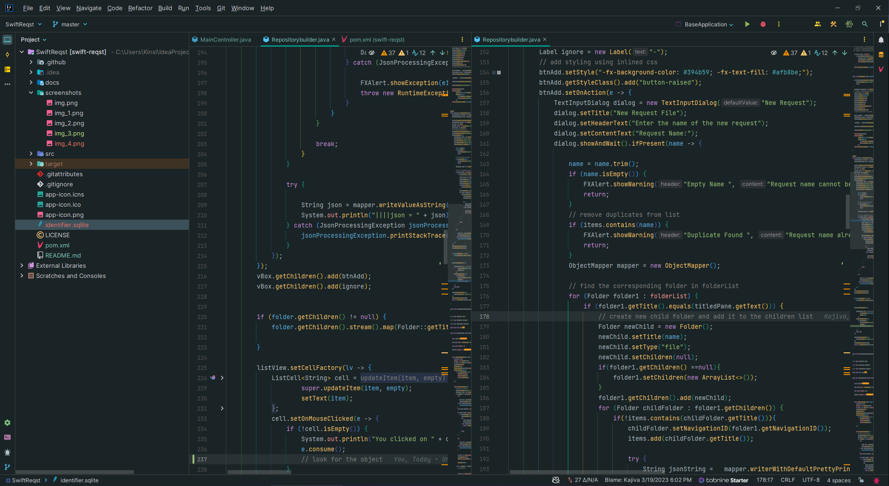
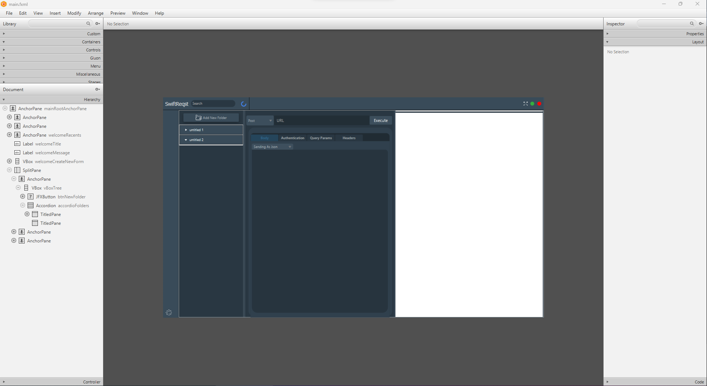
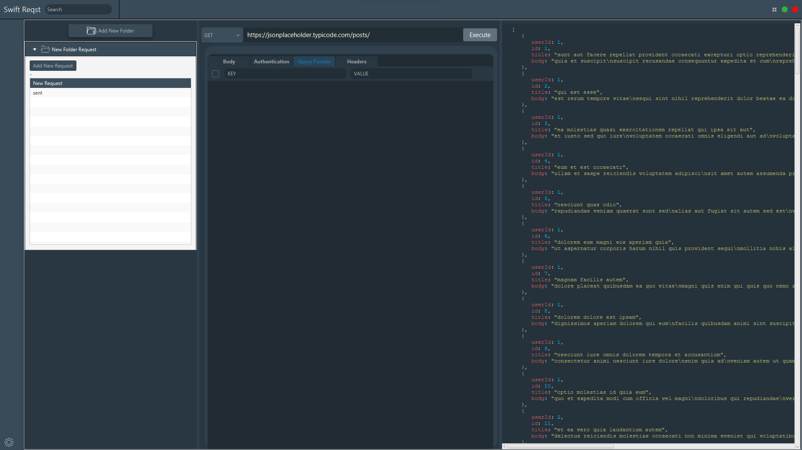
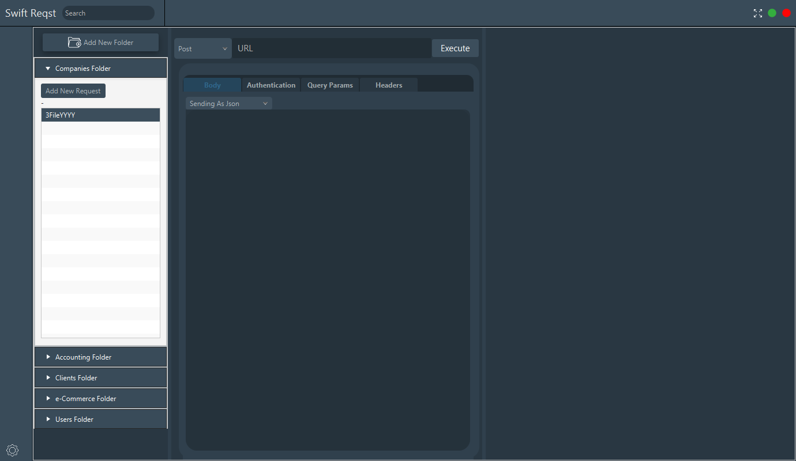
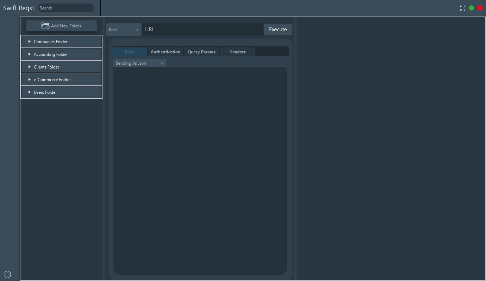
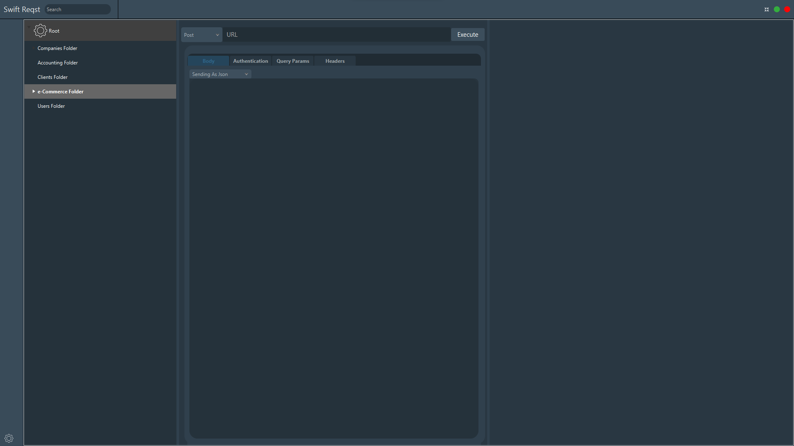

# Overview

This is a [JavaFX](https://openjfx.io/) based Http client Desktop application , This is a similar application that works like Postman and Postman .
It would be great if @jetbrains contribute to this plan to be a service that can be call or ran . [not working yet there]

# Goals

1. Build nice, small cross-platform JavaFX or Swing desktop apps with native installers!

## Dev Requirements

- Java IDE  - https://www.jetbrains.com/idea/  
- [Java 18](https://bell-sw.com/pages/downloads/#/java-18-current).
    - If you are using JavaFX, use an SDK that has JavaFX bundled:
      - [Liberica with JavaFX](https://bell-sw.com/pages/downloads/#/java-18-current)
      - [Azul Zulu with JavaFX](https://www.azul.com/downloads/?version=java-18-sts&package=jdk-fx)
    - If you are using Swing, pretty much any Java 17 or 18 JDK will work.
- [Maven](https://maven.apache.org/).
- On MacOS XCode is required.
- On Windows the free [WiX Toolset](https://wixtoolset.org/) is required.

## Installation Verification

Because these builds use stripped down JVM images, the
[generated installers are in the 30-40mb range](https://github.com/wiverson/maven-jpackage-template/releases).

On MacOS you should [add signing to avoid error messages](https://github.com/wiverson/maven-jpackage-template/issues/49)
related to the security system(s).

To [re]generate an installer, run...

`mvn clean install`

To do everything up until the actual installer generation (including generating the custom JVM)...

`mvn clean package`

To generate reports, include to check if you are using the current version[s] of your dependencies, run...

`mvn site`

## Screenshots

